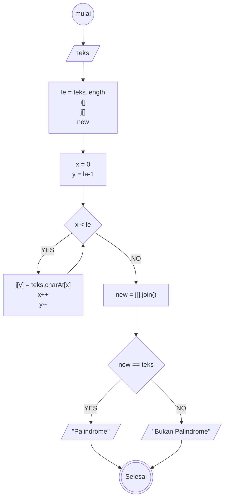
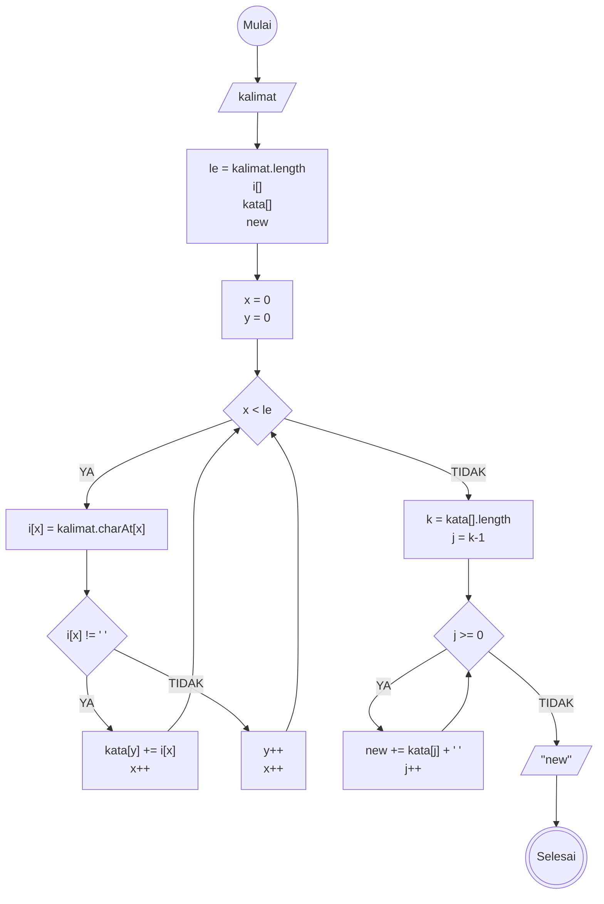

# Weekly Task Week 1: Algoritma

## Task 1 
Deteksi Palindrom: Diberikan sebuah teks, periksa apakah kata tersebut adalah palindrome atau tidak. Misalnya teks "Malam", output = palindrom

### Algoritma Deksriptif

Langkah-langkah:
1. Mulai
1. Input teks
1. Deklarasikan variabel: le = length dari teks; array j (untuk menyimpan nilai kebalikan dari teks); new (untuk menyimpan teks baru)
1. Deklarasikan variabel x sama dengan 0 dan y sama dengan nilai variabel le dikurangi 1
1. Selama x kurang dari le, maka akan menjalankan langkah 6, jika tidak maka ke langkah 7
1. Menyimpan karakter ke-x di teks ke dalam index ke-y di j, penambahan x dengan 1 dan pengurangan y dengan 1 kemudian kembali ke langkah 5
1. Menggabungkan seluruh karakter di array j dan menyimpannya ke dalam variabel new;
1. Jika nilai teks dan new sama, maka outputkan "Palindrome"
1. Jika tidak, maka outputkan "Bukan Palindrome"
1. Selesai

### Flowchart

## Task 2

Reverse Words: Diberikan sebuah kalimat, ubah urutan kata-kata di dalam kalimat menjadi terbalik. Misalnya kalimat "Saya belajar Javascript", output "Javascript belajar saya"

### Algoritma Deskriptif

Langkah-langkah:
1. Mulai
1. Input kalimat
1. Deklarasikan variabel: le = length dari kalimat; array i (untuk menyimpan huruf yang ada dalam kalimat); array kata (untuk menyimpan tiap kata); new (untuk menyimpan kalimat baru yang dibalik)
1. Deklarasikan x dan y dengan masing-masing nilai 0
1. Selama x<le bernilai benar maka akan menjalankan langkah ke-6 & 7, jika tidak akan lanjut ke langkah 10
1. Assign index ke-x di kalimat ke dalam index ke-x di i
1. Jika index ke-x dalam i bukan merupakan spasi maka lanjut ke langkah 8, jika index ke-x dalam i merupakan spasi maka lanjut ke langkah 9 
1. Menambahkan index ke-x di i ke dalam index ke-y di kata dan inkremental x, kembali ke langkah 5
1. Inkremental x dan y, kembali ke langkah 5
1. Deklarasikan variabel k = le dari array kata dan variabel j = k dikurangi 1
1. Selama j lebih besar atau sama dengan 0, maka akan menjalankan langkah 12, jika tidak maka akan menjalankan langkah 13
1. Menampung kalimat baru dengan kata yang dibalik di dalam variabel new serta inkremental j, kembali ke langkah 11
1. Outputkan new 
1. Selesai

### Flowchart

