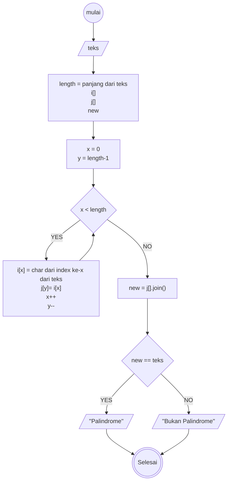
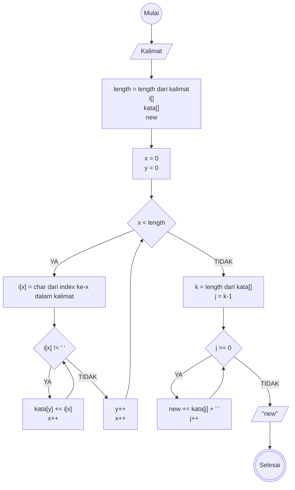

# Weekly Task Week 1: Algoritma

## Task 1 
Deteksi Palindrom
Diberikan sebuah teks, periksa apakah kata tersebut adalah palindrome atau tidak. Misalnya teks "Malam", output = palindrom

### Algoritma Deksriptif

Langkah-langkah:
1. Mulai
1. Input teks
1. Deklarasikan variabel: length = length dari teks; i[]  (untuk menyimpan nilai dari index huruf dalam teks); j[] (untuk menyimpan nilai kebalikan dari teks); new (untuk menyimpan teks baru)
1. Deklarasikan x = 0 dan y = length - 1
1. Jika x<length, maka 
1. i[x] = char dari index ke-x dari teks; j[y]=i[x]; x++; y--
1. new = j[].join();
1. Jika teks == new, maka
1. Outputkan "Palindrome"
1. Jika tidak, maka
1. Outputkan "Bukan Palindrome"
1. Selesai

### Flowchart

## Task 2

Reverse Words: Diberikan sebuah kalimat, ubah urutan kata-kata di dalam kalimat menjadi terbalik. Misalnya kalimat "Saya belajar Javascript", output "Javascript belajar saya"

### Algoritma Deskriptif

Langkah-langkah:
1. Mulai
1. Input kalimat
1. Deklarasikan variabel: length = length dari kalimat; array i (untuk menyimpan huruf yang ada dalam kalimat); array kata (untuk menyimpan tiap kata); new (untuk menyimpan kalimat baru yang dibalik)
1. Deklarasikan x = 0 dan y = 0
1. Jika x<length maka akan lanjut ke langkah 8, jika tidak
1. Assign index ke-x dalam kalimat ke index ke-x dalam i
1. Jika index ke-x dalam i bukan merupakan spasi maka lanjut ke langkah berikutnya
1. Menambahkan index ke-x dalam i ke index ke-y dalam kata dan inkremental x
1. Deklarasikan k = length dari kata[]; j = k-1
1. Jika j >= 0, maka
1. new += kata[j] + " "
1. Outputkan new 
1. Selesai

### Flowchart

