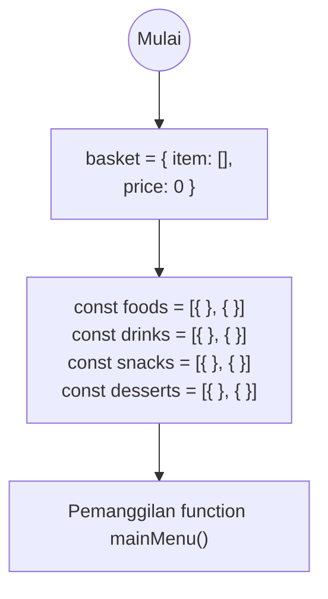
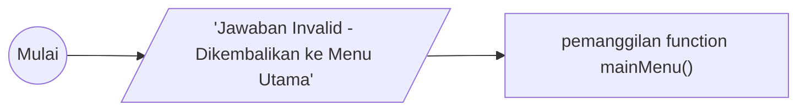
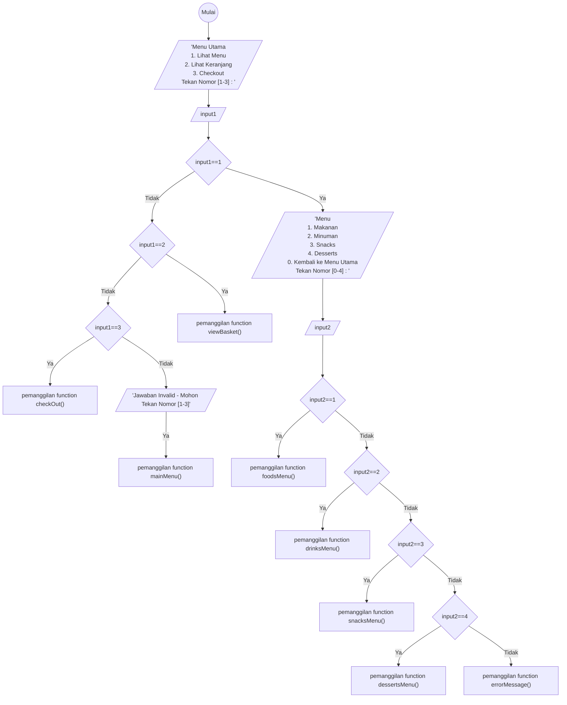
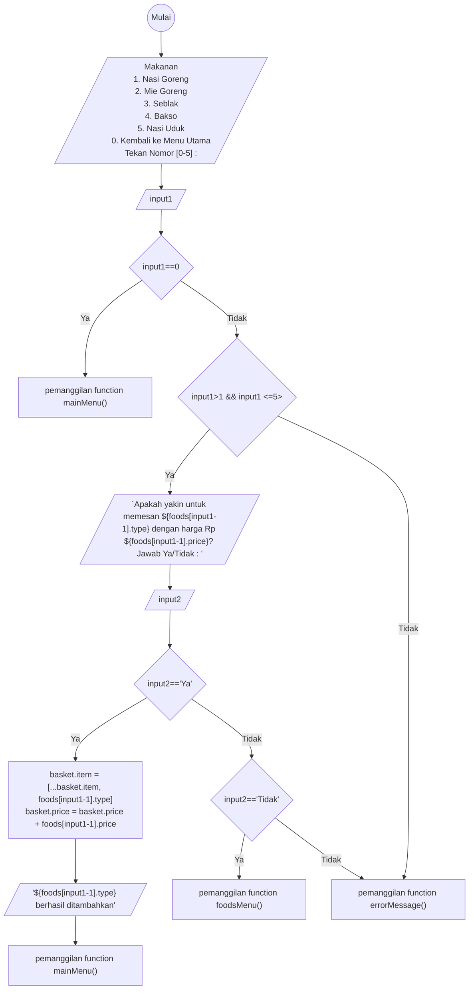
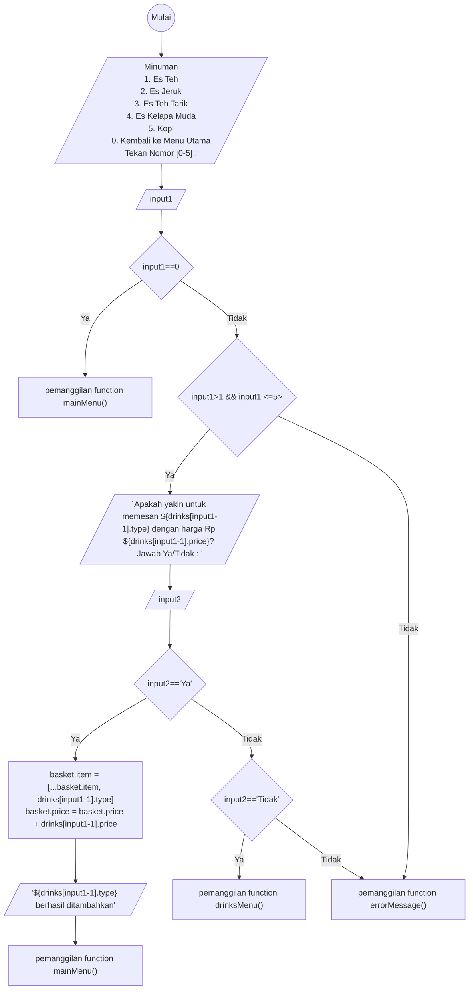
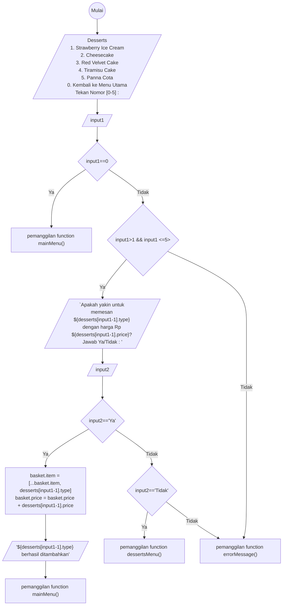
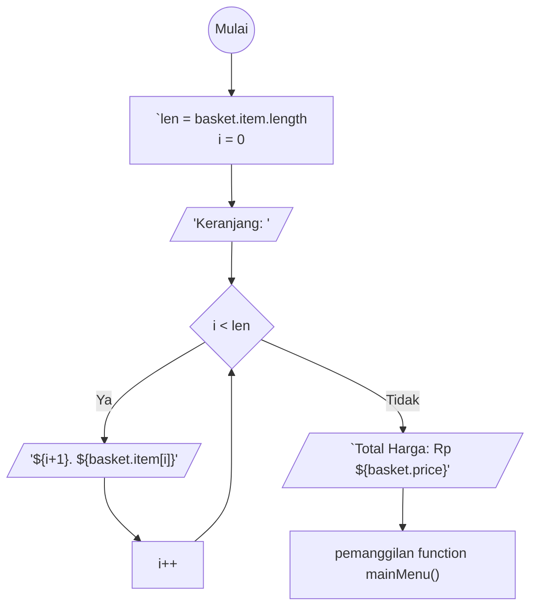
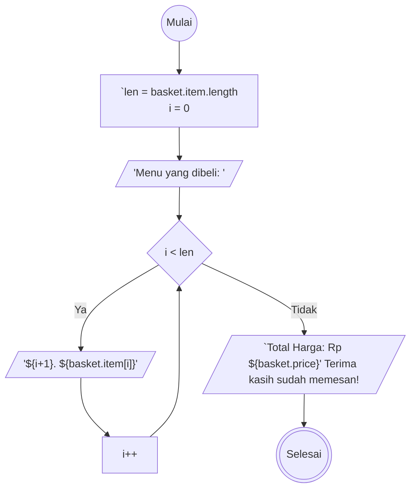

## Program Menu

## Function errorMessage

## Function mainMenu

## Function foodsMenu

## Function drinksMenu

## Function snacksMenu

## Function dessertsMenu

## Function viewBasket

## Function checkOut
